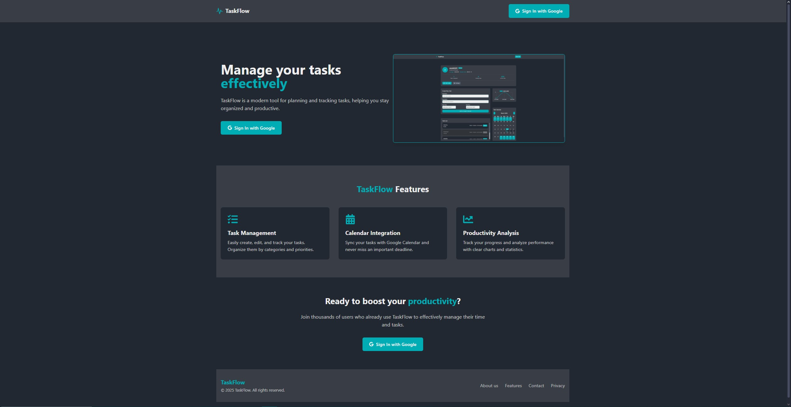

# TaskFlow - Smart Task Management Application

## Overview

TaskFlow is a modern task management application built with React that combines task organization with Google Calendar integration. It helps users efficiently manage their tasks, track progress, and visualize their productivity through interactive charts.



## Features

- 🔐 Google Authentication
- ✅ Task Creation and Management
- 📅 Google Calendar Integration
- 📊 Real-time Progress Charts
- 👤 Personalized User Profiles
- 📈 Task Completion Statistics
- 🎨 Modern Dark Theme Interface
- 📱 Responsive Design

## Technology Stack

### Frontend

```javascript
{
  "dependencies": {
    "@heroicons/react": "^2.2.0",

    "@tailwindcss/vite": "^4.0.6",
    "@types/react-datepicker": "^6.2.0",
    "chart.js": "^4.4.7",
    "date-fns": "^4.1.0",
    "react": "^18.3.1",
    "react-big-calendar": "^1.18.0",
    "react-chartjs-2": "^5.3.0",
    "react-datepicker": "^8.0.0",
    "react-datetime-picker": "^6.0.1",
    "react-dom": "^18.3.1",
    "react-icons": "^5.5.0",
    "react-router-dom": "^7.1.5",
    "tailwindcss": "^4.0.6",
    "zustand": "^5.0.3"
  }
}
```

### Backend & Authentication

```javascript
{
  "dependencies": {
    "@supabase/auth-helpers-react": "^0.5.0",
    "@supabase/supabase-js": "^2.48.1",
  }
}
```

### Integration

- Google Calendar API

## Getting Started

### Prerequisites

- Node.js
- npm or yarn
- Supabase account
- Google Cloud Console project with Calendar API enabled

### Installation

```bash
# Clone the repository
git clone https://github.com/zeneksolufka/taskflow.git

# Navigate to project directory
cd taskflow

# Install dependencies
npm install

# Create .env file
cp .env.example .env
```

### Environment Variables

```env
VITE_SUPABASE_URL=your_supabase_url
VITE_SUPABASE_ANON_KEY=your_supabase_anon_key
VITE_GOOGLE_CLIENT_ID=your_google_client_id
```

### Running the Application

```bash
# Development mode
npm run dev

# Build for production
npm run build

# Preview production build
npm run preview
```

### Supabase Setup

1. Create a new Supabase project
2. Enable Google Authentication
3. Set up database tables for tasks:

### Google Calendar API Setup

1. Create a project in Google Cloud Console
2. Enable Calendar API
3. Configure OAuth consent screen
4. Create credentials (OAuth client ID)

---

Made with ❤️ by [Kacper Chełstowski]
